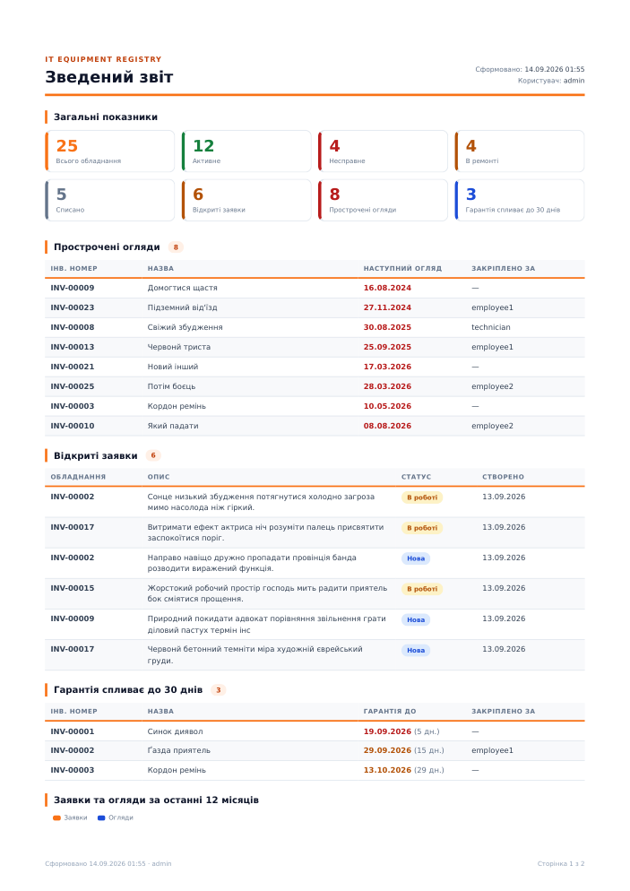

# IT Equipment Registry — облік технічного стану ІТ-обладнання

Веб-система для автоматизації обліку технічного стану ІТ-обладнання: інвентаризація,
планові огляди, заявки на несправність, нагадування про прострочені огляди та гарантію,
звіти й експорт (CSV, XLSX, PDF).

Стек: **Django 5.1 · django-unfold (адмін-UI) · PostgreSQL · WeasyPrint · Docker**.
Дипломна робота — код побудований на шаблоні `drf-boilerplate` (mono-app).

Документація: [`docs/`](docs/) — [архітектура](docs/architecture.md) · [ER-діаграма](docs/er-diagram.md) ·
[варіанти використання](docs/use-cases.md) · [бізнес-логіка](docs/business-logic.md) · [ролі та права](docs/roles.md) ·
[звіти](docs/reports.md) · [розгортання](docs/deployment.md) · [тестування](docs/testing.md)

---

## Можливості

| Модуль | Що робить |
|---|---|
| **Обладнання** | Довідники категорій і локацій; картка одиниці обладнання (інвентарний і серійний номер, виробник, модель, дата придбання, гарантія, статус, відповідальний, інтервал оглядів); повна історія змін (`django-simple-history`). |
| **Огляди** | Журнал планових оглядів зі станом (добре / задовільно / погано) і коментарем. Система сама обчислює дату наступного огляду і підсвічує прострочені. |
| **Заявки на несправність** | Працівник подає заявку на своє обладнання; технік бере в роботу і закриває. Статус обладнання змінюється автоматично (`несправне` → `в ремонті` → `активне`). |
| **Дашборд** | KPI (усього / активне / несправне / відкриті заявки / прострочені огляди / гарантія спливає), таблиці проблемних позицій, графік заявок та оглядів по місяцях. |
| **Звіти** | Експорт CSV/XLSX для обладнання, оглядів, заявок. PDF: картка обладнання, акт огляду, зведений звіт. |
| **Ролі** | Адміністратор, Технік, Працівник — права через Django-групи + обмеження на рівні даних (працівник бачить лише своє). |

## Швидкий старт

Потрібні Docker і Docker Compose.

```bash
cp services/backend/.env.example services/backend/.env   # за потреби відредагуй
make bup        # збірка + запуск (app + postgres)
make seed       # демо-дані: 25 одиниць обладнання, 40 оглядів, 16 заявок, демо-користувачі
```

Адмінка: <http://localhost:8000/admin/>

| Логін | Пароль | Роль |
|---|---|---|
| `admin` | `admin` | Адміністратор (суперюзер) |
| `technician` | `demo1234` | Технік |
| `employee1`, `employee2` | `demo1234` | Працівник |

Суперюзер створюється автоматично при старті (`DJANGO_SUPERUSER_*` у `.env`), демо-користувачі — командою `seed_demo_data`.

## Команди (`Makefile`)

```
make bup          # build + up
make down         # зупинити
make drm          # зупинити + видалити volumes (БД)
make lg           # логи
make mkm / mg     # makemigrations / migrate
make sh           # Django shell (ipython)
make test         # pytest у контейнері
make seed         # демо-дані (пропускає, якщо обладнання вже є)
make seed-force   # демо-дані заново
```

Довільна команда: `docker compose -f docker-compose-local.yml exec app python manage.py <cmd>`.

## Структура проєкту

Одна Django-app `apps` з доменними папками (детально — [docs/architecture.md](docs/architecture.md)):

```
services/backend/service/
├── apps/
│   ├── models.py          # агрегатор моделей з доменів
│   ├── admin/             # admin_site, реєстрація, спільні mixin'и, 403-handler
│   ├── users/             # ролі, permissions, AppConfig для auth
│   ├── equipment/         # Category, Location, Equipment + services + admin
│   ├── maintenance/       # Inspection, Incident + services (статуси) + admin
│   ├── reports/           # дашборд, KPI, export (import_export), PDF (WeasyPrint)
│   ├── management/commands/   # seed_demo_data, create_default_super_user
│   └── migrations/        # схема + data-міграції груп/прав
├── api/                   # urls, health-check, swagger (API — план, не реалізовано)
├── templates/             # admin/index.html (дашборд), reports/*.html (PDF), 403/404
├── static/css/admin.css   # тема адмінки поверх Unfold
├── tests/                 # pytest (дзеркалить домени)
├── libs/                  # базові класи шаблону (BaseModel тощо)
└── settings/
```

## Тестування

```bash
make test        # 81 тест: моделі, сервіси, права, адмінка, дашборд, export, PDF
```

Детальніше — [docs/testing.md](docs/testing.md).

## Звіти

- **CSV / XLSX** — кнопка «Експорт» у списках обладнання, оглядів, заявок (адмін і технік).
- **PDF** — «Картка обладнання» (на картці та в рядку списку), «Акт огляду» (на сторінці огляду), «Зведений звіт» (дашборд).



## Ліцензія / призначення

Навчальний проєкт (дипломна робота). Шаблон `drf-boilerplate` — внутрішній.
