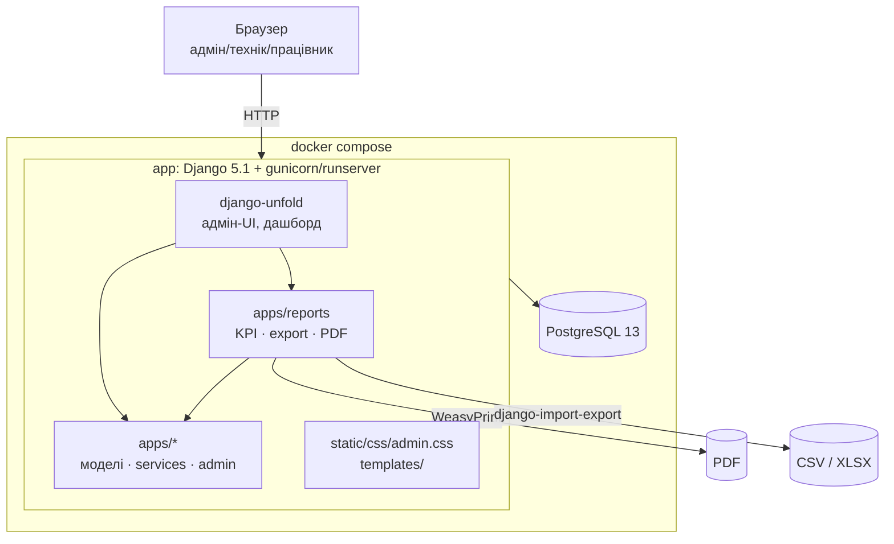
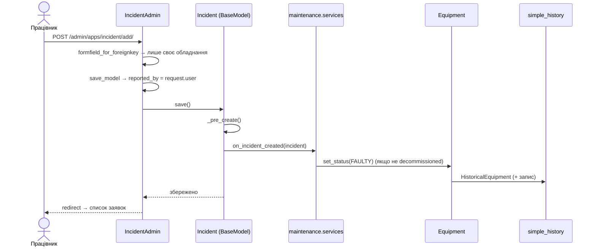

# Архітектура

## Огляд



Монолітний Django-застосунок. UI — виключно адмін-панель `django-unfold` (кастомізована). REST API (DRF)
закладено в шаблоні (`api/v1/`, Swagger), але в поточному обсязі не реалізовано.

## Mono-app з доменними папками

У `INSTALLED_APPS` **одна** прикладна app — `apps`. Усередині — доменні Python-пакети, кожен зі своїм набором файлів:

```
apps/
├── models.py            ← агрегатор: from apps.equipment.models import ...; from apps.maintenance.models import ...
├── apps.py              ← AppConfig (verbose_name "Панель керування")
├── admin/
│   ├── site.py          ← CustomAdminSite(UnfoldAdminSite): app_index → redirect, URL /admin/reports/summary.pdf
│   ├── admins.py        ← реєстрація всіх ModelAdmin у admin_site
│   ├── model_admin.py   ← UserAdmin, GroupAdmin, TimestampsAdminMixin
│   └── errors.py        ← handler403 у layout адмінки
├── users/               ← choices (Role, назви груп), permissions (is_admin/is_technician/is_employee), apps.py (auth verbose_name)
├── equipment/           ← models, choices, services (overdue/warranty/last inspection), admin
├── maintenance/         ← models, choices, services (переходи статусів), admin
├── reports/             ← services (KPI, списки, по місяцях), dashboard (callback), resources (export), pdf, views
├── management/commands/ ← seed_demo_data, create_default_super_user
└── migrations/          ← одна лінійка міграцій для всіх моделей
```

Чому так: Django бачить моделі лише через `apps/models.py`, тому агрегатор обов'язковий. Усі моделі — в одній лінійці міграцій
(`apps.0001…0006`). Доменні папки — звичайні пакети, не Django apps, тому нових записів у `INSTALLED_APPS` немає.

## Шари

| Шар | Файли | Правило |
|---|---|---|
| Моделі | `apps/<domain>/models.py` | Наслідують `libs.db.models.BaseModel` (uuid PK, created/updated, хуки `_pre_create`/`_pre_update`). Без `save()`-override, без сигналів. |
| Сервіси | `apps/<domain>/services.py` | Чисті функції над ORM. Уся бізнес-логіка (статуси, overdue, KPI). |
| Адмінка | `apps/<domain>/admin.py` | Unfold `ModelAdmin`; ролі — через `get_queryset` / `get_readonly_fields` / `formfield_for_foreignkey`; PDF — `@action`. |
| Презентація | `templates/`, `static/css/admin.css` | Дашборд `admin/index.html`, PDF `reports/*.html`, 403/404, override сайдбару. |
| Тести | `tests/<domain>/` | pytest + pytest-django + factory_boy. |

## Потік даних: заявка на несправність



## Дашборд і PDF

- `UNFOLD["DASHBOARD_CALLBACK"] = apps.reports.dashboard.dashboard_callback` формує контекст для `templates/admin/index.html`.
- `get_scoped_querysets(user)` — спільна точка обмеження даних за роллю для дашборду **і** PDF-зведення.
- PDF: `apps/reports/pdf.py` рендерить Django-шаблон → WeasyPrint → bytes. Кириличний шрифт DejaVu Sans (пакет `fonts-dejavu-core` у Dockerfile).
- Export: `apps/reports/resources.py` (`ModelResource`) + `ExportActionModelAdmin` у admin-класах; формати CSV/XLSX (`IMPORT_EXPORT_FORMATS`).

## Стилізація Unfold

Unfold постачає скомпільований Tailwind — довільні utility-класи не працюють. Тому:
- глобальний CSS — `static/css/admin.css` через `UNFOLD["STYLES"]`; CSS-змінні `--c-*`, dark mode через `html.dark`;
- дашборд — власний `<style>` у ``;
- override-шаблони: `admin/nav_sidebar.html` (згортання до іконок), `unfold/helpers/change_list_headers.html` (заголовок над колонкою дій).

## Інфраструктура

- `docker-compose-local.yml`: `app` (volume-mount коду, runserver, `local.entrypoint.sh`: migrate → collectstatic → create_default_super_user), `pgdb` (`postgres:13-alpine`).
- `docker-compose.yml` / `prod.docker-compose.yml`: gunicorn, `entrypoint.sh`.
- `Dockerfile`: `python:3.12`, системні бібліотеки для WeasyPrint (pango, cairo, harfbuzz) + DejaVu.
- Статика: `STATICFILES_DIRS=[static/]` → `collectstatic` → `backend-static/` (або S3 при `USE_S3=1`).
