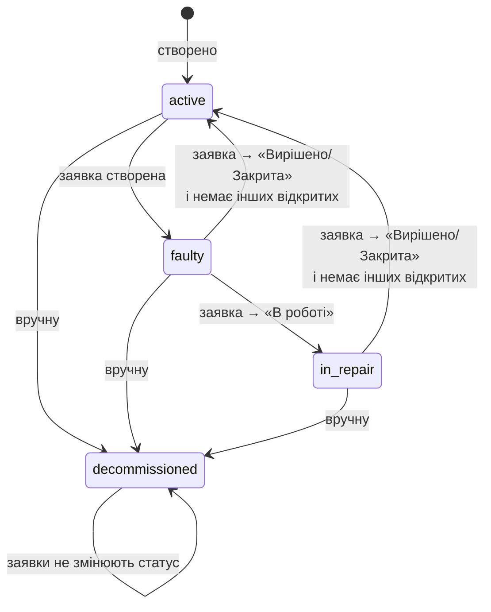
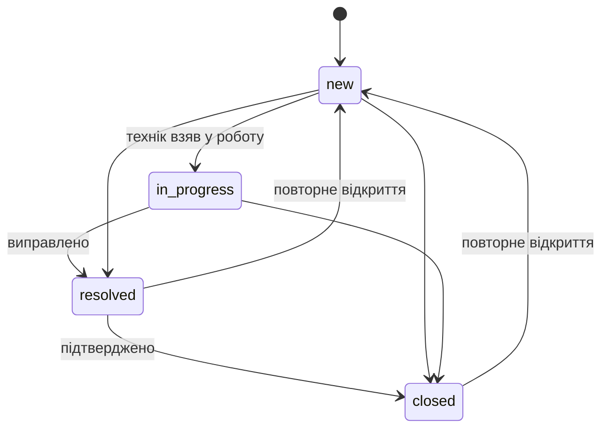

# Бізнес-логіка

Уся логіка — у `apps/<domain>/services.py`, викликається з хуків `BaseModel._pre_create` / `_pre_update`
(`libs/db/models.py`). `save()` не перевизначається, сигнали не використовуються.

## Статуси обладнання

Статус можна змінити і вручну (адміністратор — будь-які поля, технік — лише `status`).
`decommissioned` — термінальний для автоматики: сервіси його не перезаписують.

## Статуси заявки

| Перехід заявки | Ефект (`apps/maintenance/services.py`) |
|---|---|
| створення | `on_incident_created`: обладнання → `faulty` (крім `decommissioned`) |
| `new → in_progress` | обладнання → `in_repair` |
| `→ resolved` / `→ closed` | `resolved_at = now` (якщо порожнє); обладнання → `active`, якщо `has_open_incidents(equipment, exclude=this) == False` |
| `resolved/closed → new/in_progress` | `resolved_at = None`; обладнання → `faulty` / `in_repair` |
| зміна не-статусних полів | нічого |

`_pre_update` читає попередній статус одним запитом по `pk`. `bulk_create` / `queryset.update()` хуки обходять
(стандартна поведінка Django) — у seed це використано навмисно для backdating.

## Огляди

- Огляд **не** змінює статус обладнання, навіть при стані «погано» — це сигнал техніку (бейдж в адмінці/PDF).
- `next_inspection_at = last_inspection_at + inspection_interval_days` (за замовчуванням 180 днів).
  Якщо оглядів не було — від `purchase_date`. Якщо і її немає — огляд не планується.
- Прострочено: `next_inspection_at < today`. Списане обладнання виключається зі статистики.

## Гарантія

`is_warranty_expiring`: `today <= warranty_until <= today + 30`. На дашборді ≤ 7 днів — червоним, інакше жовтим.
Прострочена гарантія (`warranty_until < today`) окремо не підсвічується — видно в картці.

## Продуктивність

Розрахунок «останній огляд» для списків робиться однією анотацією
`with_last_inspection(queryset)` (`MAX(inspections.performed_at)`), а не запитом на кожен рядок.
Дашборд — 14 SQL-запитів, список обладнання — ~23.
