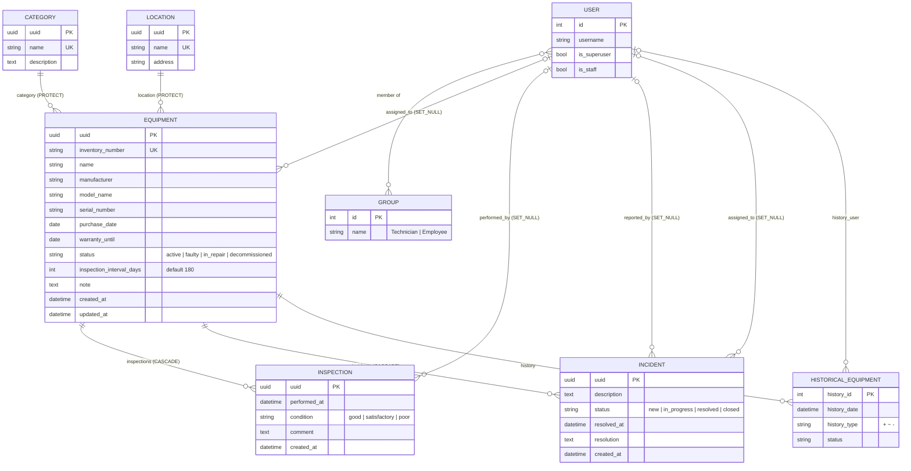

# ER-діаграма

Усі предметні моделі наслідують `libs.db.models.BaseModel`: первинний ключ `uuid`,
`created_at`, `updated_at`. `Equipment` додатково веде історію змін (`HistoricalEquipment`,
`django-simple-history`). Користувачі — стандартна `auth.User`, ролі — `auth.Group`.

## Обчислювані атрибути `Equipment` (не зберігаються в БД)

| Атрибут | Правило | Де реалізовано |
|---|---|---|
| `last_inspection_at` | `MAX(inspections.performed_at)` | `apps/equipment/services.py::get_last_inspection_at` (анотація `with_last_inspection` проти N+1) |
| `next_inspection_at` | `last_inspection_at + inspection_interval_days`; якщо оглядів не було — `purchase_date + interval`; інакше `None` | `get_next_inspection_at` |
| `is_inspection_overdue` | `next_inspection_at < today` | `is_inspection_overdue` |
| `is_warranty_expiring` | `today <= warranty_until <= today + 30 днів` | `is_warranty_expiring` |

## Міграції

| Файл | Зміст |
|---|---|
| `0001_initial` | Category, Location, Equipment, HistoricalEquipment |
| `0002_groups` | data: групи `Technician`, `Employee` + права на equipment-моделі |
| `0003_incident_inspection` | Inspection, Incident |
| `0004_groups_maintenance` | data: права груп на Inspection/Incident |
| `0005_alter_historicalequipment_options` | українська назва історії |
| `0006_technician_inspection_readonly` | data: технік — лише створення/перегляд оглядів |

Групи і права відтворюються на порожній БД командою `migrate` (виконується в entrypoint контейнера).
