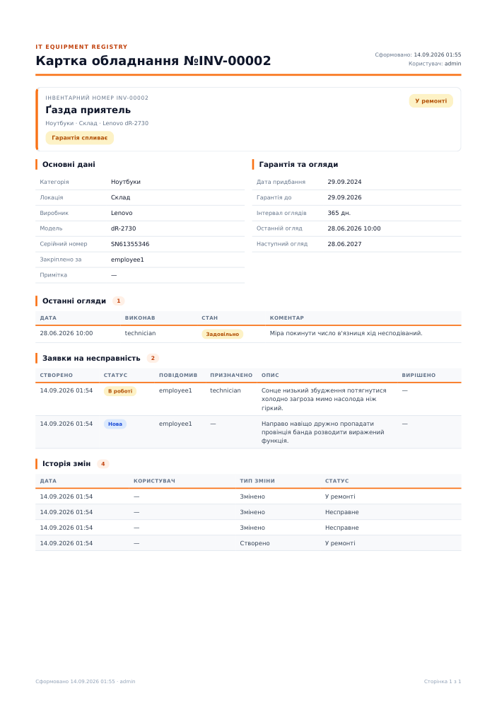
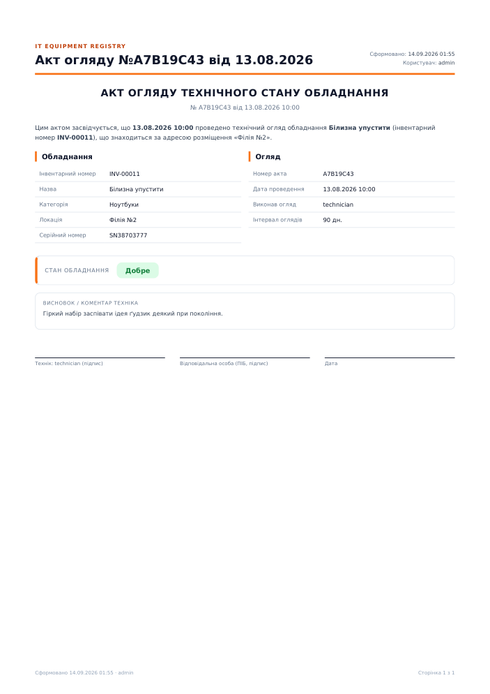
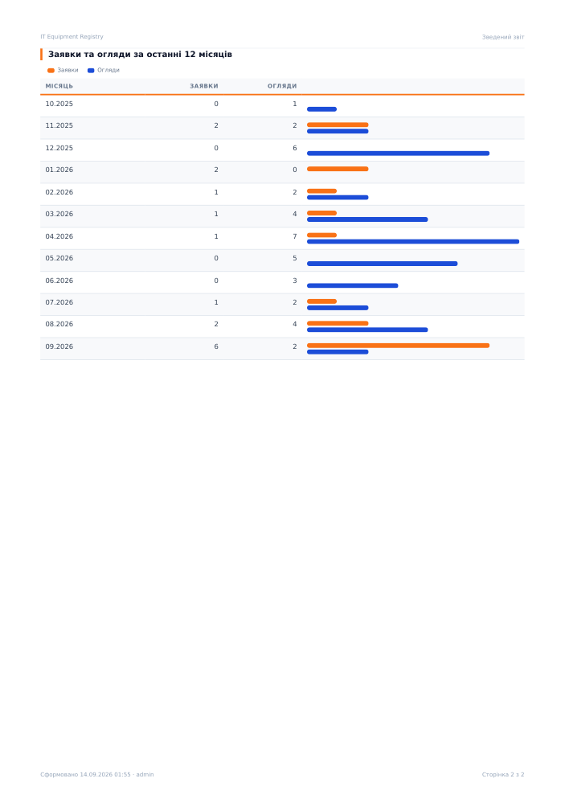

# Звіти та експорт

## Дашборд (`/admin/`)

| Блок | Джерело |
|---|---|
| KPI-картки (6) | `apps.reports.services.get_summary` |
| Прострочені огляди (топ-10, найдавніші зверху) | `get_overdue_equipment` |
| Відкриті заявки (топ-10, новіші зверху) | `get_open_incidents` |
| Гарантія спливає до 30 днів (з к-стю днів; ≤7 — червоним) | `get_warranty_expiring_equipment` |
| Графік: заявки та огляди по місяцях (12 міс., Chart.js через Unfold) | `get_incidents_by_month`, `get_inspections_by_month` |

Кожен рядок таблиць має кнопку «Відкрити». Працівник бачить дані лише по своєму обладнанню.

## Експорт CSV / XLSX

Кнопка «Експорт» у списках **Обладнання**, **Огляди**, **Заявки** (адмін і технік; працівник — 403).
Також action «Експорт вибраних» для відмічених рядків. Колонки — українські, FK — читабельні назви,
дати — `dd.mm.yyyy`, дата-час — `dd.mm.yyyy HH:MM` (Київ). Реалізація: `apps/reports/resources.py`.

## PDF (WeasyPrint)

| Звіт | Де кнопка | URL | Хто |
|---|---|---|---|
| Картка обладнання | картка обладнання (зверху) та «…» у рядку списку | `/admin/apps/equipment/<uuid>/equipment-card-pdf/` | усі; працівник — лише своє (інакше 404) |
| Акт огляду | сторінка огляду та «…» у рядку списку | `/admin/apps/inspection/<uuid>/inspection-act-pdf/` | адмін, технік |
| Зведений звіт | дашборд (кнопка справа зверху) | `/admin/reports/summary.pdf` | усі; працівник — по своєму |

Усі відкриваються в новій вкладці, `Content-Disposition: inline`.

Шаблони: `templates/reports/base_pdf.html` (дизайн: палітра, `@page` колонтитули з номером сторінки, таблиці, бейджі)
+ `equipment_card.html`, `inspection_act.html`, `dashboard_summary.html`. Код: `apps/reports/pdf.py`.

### Картка обладнання


### Акт огляду


### Зведений звіт



## Як перевірити локально

```bash
docker compose -f docker-compose-local.yml exec app python - <<'PY'
import django, os
os.environ.setdefault("DJANGO_SETTINGS_MODULE", "settings.settings"); django.setup()
from django.contrib.auth import get_user_model
from apps.models import Equipment
from apps.reports import pdf
user = get_user_model().objects.get(username="admin")
open("/tmp/card.pdf", "wb").write(pdf.equipment_card_pdf(Equipment.objects.first(), user))
PY
docker cp app:/tmp/card.pdf ./card.pdf
```
