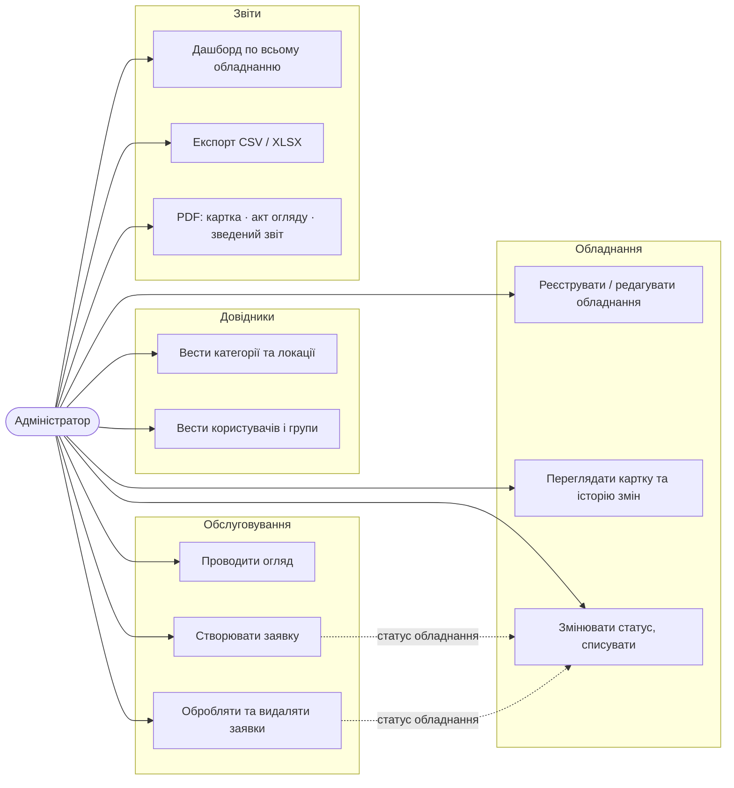
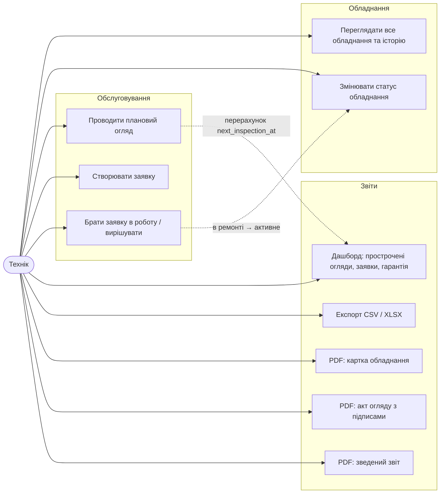
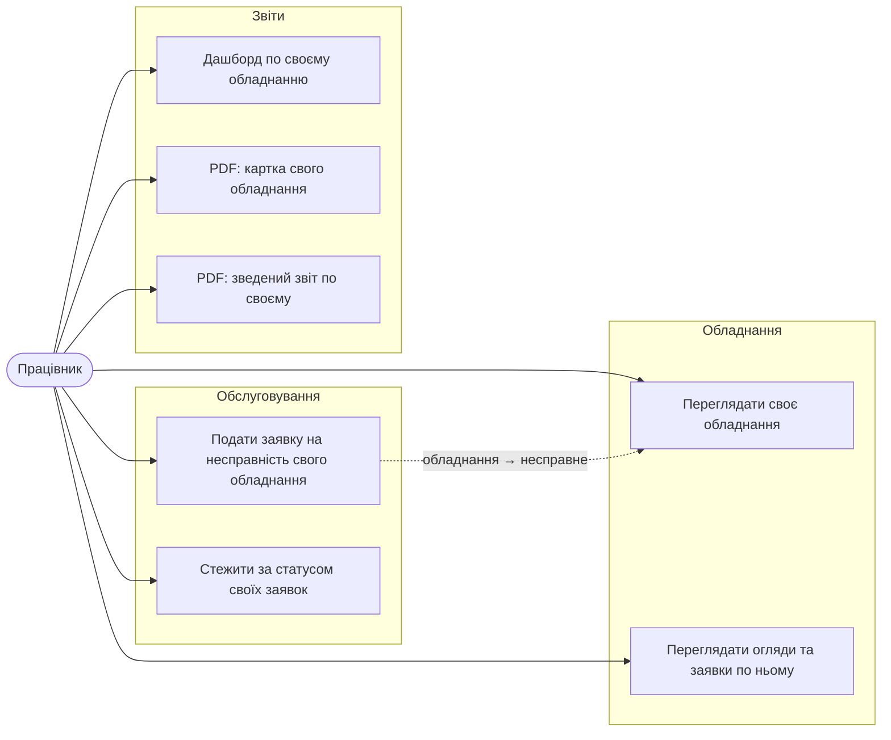

# Варіанти використання

## Діаграми за ролями

Mermaid не має нотації use-case, тому — flowchart: актор зліва, варіанти використання праворуч.
Пунктир — автоматична реакція системи.

### Адміністратор

### Технік

Довідники (категорії, локації) — лише читання. Редагувати огляди після створення та видаляти заявки технік не може.

### Працівник

Працівник не бачить чужого обладнання і чужих заявок, не змінює статус/рішення заявки, не має експорту та актів огляду.
Пункти меню без права `view_*` приховані.

## Опис ключових сценаріїв

### UC8 — Подати заявку на несправність (Працівник)
1. Працівник відкриває «Заявки на несправність» → «Додати».
2. У полі «Обладнання» доступне лише закріплене за ним обладнання.
3. Вводить опис, зберігає. `reported_by` підставляється автоматично.
4. **Система**: статус обладнання → `Несправне` (якщо не `Списане`).
5. Заявка з'являється у техніка та на дашборді в «Відкриті заявки».

### UC9 — Обробити заявку (Технік)
1. Технік відкриває заявку, призначає себе, ставить статус `В роботі`.
   **Система**: обладнання → `В ремонті`.
2. Після ремонту — статус `Вирішено`, заповнює «Рішення».
   **Система**: `resolved_at = now`; обладнання → `Активне`, **якщо** на ньому немає інших відкритих заявок.
3. Повторне відкриття (`Вирішено` → `Нова`) скидає `resolved_at`, обладнання знову `Несправне`.

### UC7 — Провести плановий огляд (Технік)
1. Дашборд → «Прострочені огляди» → «Відкрити» → вкладка «Огляди» → додати.
2. Вказує стан (добре / задовільно / погано) і коментар; `performed_by` автоматично.
3. **Система**: `next_inspection_at` перераховується як `performed_at + inspection_interval_days`; позиція зникає зі списку прострочених.
4. За потреби — «Акт огляду (PDF)» з полями для підписів.

### UC10 — Дашборд
- KPI: усього / активне / несправне / відкриті заявки / прострочені огляди / гарантія спливає до 30 днів.
- Таблиці: прострочені огляди (найдавніші зверху), відкриті заявки, гарантія (з кількістю днів).
- Графік: заявки та огляди по місяцях за 12 місяців.
- Працівник бачить дані лише по своєму обладнанню.

### UC11–UC14 — Звіти
Див. [reports.md](reports.md).
